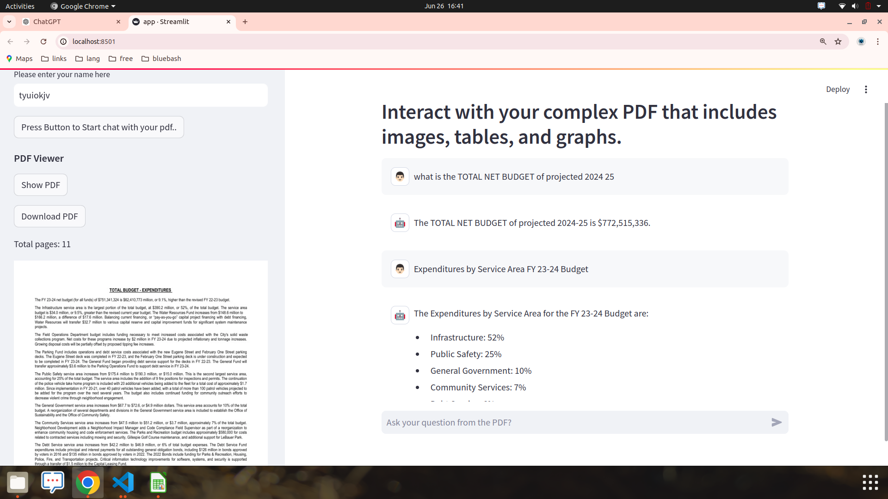
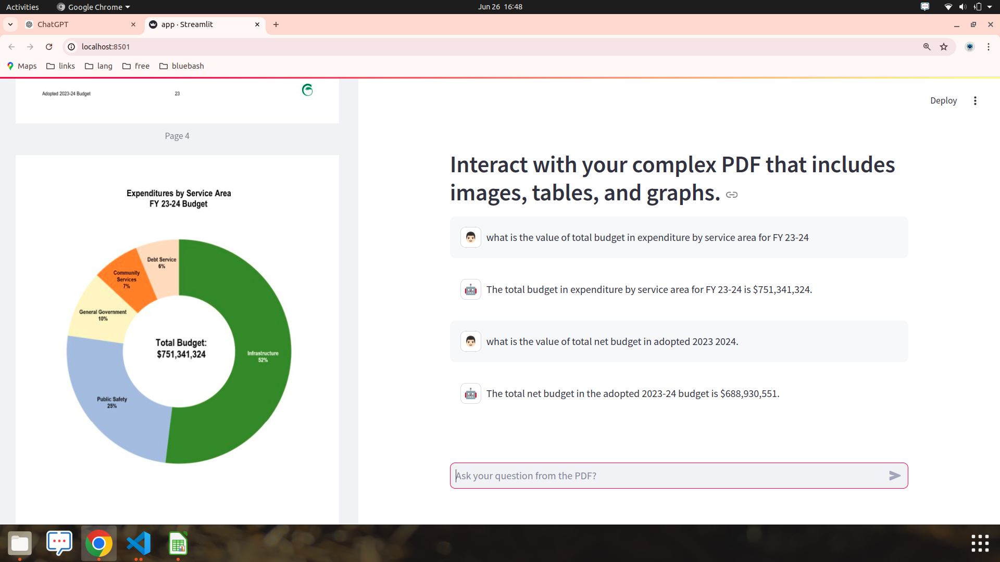

# Interact with your complex PDF that includes images, tables, and graphs.


## Table of Contents

- [Introduction](#introduction)
- [Features](#features)
- [Technologies Used](#technologies-used)
- [Setup Instructions](#setup-instructions)
- [Usage](#usage)


## Introduction

The PDF Chatbot project simplifies the process of extracting and querying information from Complex PDF documents, including complex content such as tables, graphs, and images. Leveraging state-of-the-art natural language processing models and Unstructured.io for document parsing, the chatbot provides a user-friendly interface to interact with and retrieve detailed information from these documents.


## Features

- **Table Extraction**: Identify and parse tables to retrieve structured data, making it easier to answer data-specific questions.
- **Graph Interpretation**: Recognize and analyze graphs to offer insights based on visual data representations.
- **Image Analysis**: Extract and interpret images within the PDFs to provide contextually relevant information.


## Technologies Used

- **LangChain**: Framework for building applications with language models.
- **RAG (Retrieval-Augmented Generation)**: Combines retrieval and generation for more accurate answers.
- **Streamlit**: Framework for creating interactive web applications with Python.
- **Unstructured.io**: Tool for parsing and extracting complex content from PDFs, such as tables, graphs, and images.
- **Poetry**: Dependency management and packaging tool for Python.


## Setup Instructions

Follow these steps to set up the project on your local machine:


**1. Clone the Repository:**
- Begin by cloning the repository to your local machine:
```
https://github.com/langchain-tech/unstructured-io-demo.git
cd unstructured-io-demo
```

**2. Install project dependencies:**
- Use Poetry to install the dependencies defined in your pyproject.toml file. This command will also respect the versions pinned in your poetry.lock file:
```
poetry install
```
This will create a virtual environment (if one does not already exist) and install the dependencies into it.


**3. Activate the virtual environment (optional):**
- If you want to manually activate the virtual environment created by Poetry, you can do so with:
```
poetry shell
```
This step is optional because Poetry automatically manages the virtual environment for you when you run commands through it.


**4. Set Up Environment Variables:**
Create a .env file in the root directory of your project and add the required environment variables. For example:
```
OPENAI_API_KEY=Your_OPENAI_API_KEY
POSTGRES_URL_EMBEDDINDS=YOUR_POSTGRES_URL
POSTGRES_URL=YOUR_POSTGRES_URL
PINECONE_API_KEY = YOUR_PINECONE_API_KEY
```


**5. Start the Application:**

Run the application using Streamlit:
```
streamlit run app.py
```


**1. Clone the Repository**

## Examples




## Instructions for Setting Up Data Ingestion from Google Drive

Follow these steps to set up data ingestion from Google Drive:

**1. Authorize Google Drive Access:**
- Open your Google Drive.
- Navigate to the settings and authorize the application that will be used for data ingestion.


**2. Configure API Settings:**
- Obtain the API key and OAuth credentials from the Google Cloud Console.
- Configure the application to use these credentials for accessing Google Drive.

**3. Create a Virtual Environment:**
- It is recommended to create a virtual environment to manage dependencies:
```
python -m venv venv
source venv/bin/activate   # On Windows, use `venv\Scripts\activate`
```

**4. Install Dependencies:**
- Install the necessary packages listed in the unstructed_requirements.txt file:
```
pip install -r unstructed_requirements.txt
```

**5. Run the command:**
- Execute the following command to start the data ingestion:
```
python3 google_drive_ingest.py
```

